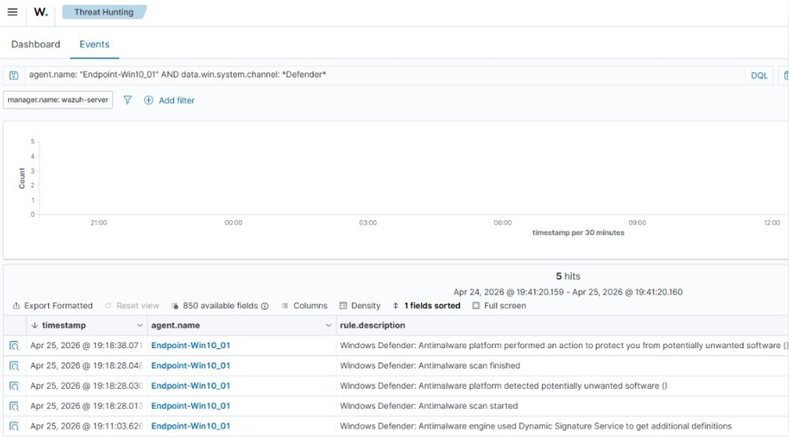
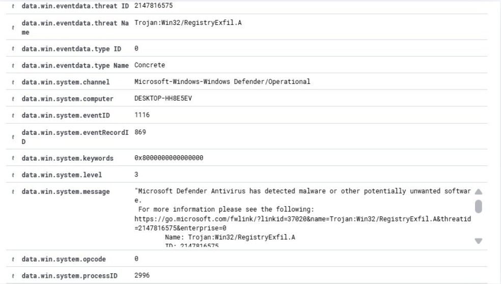
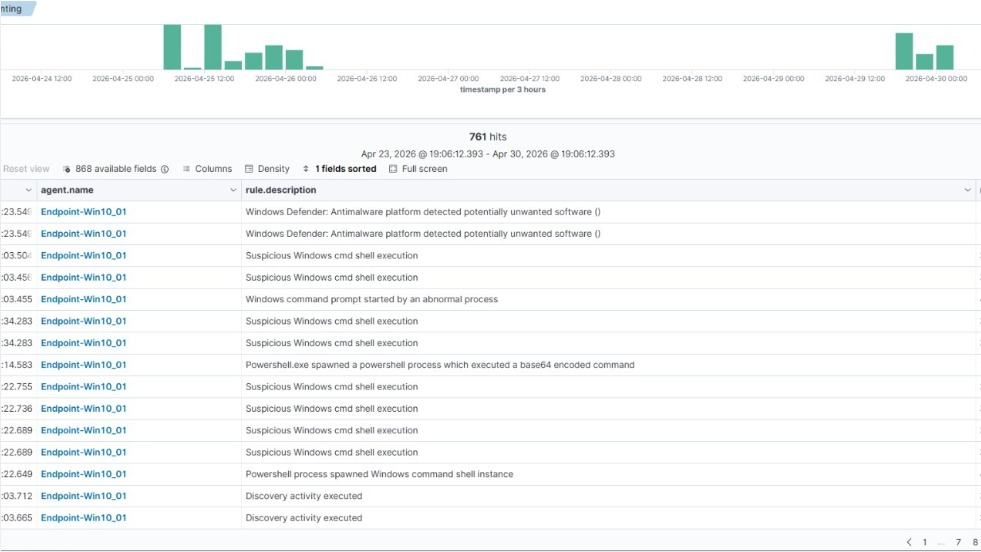
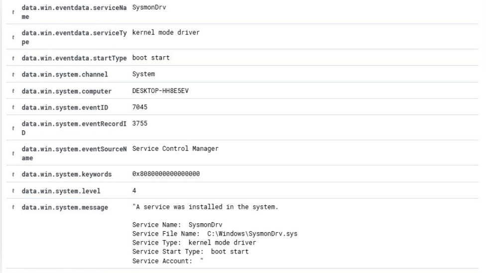
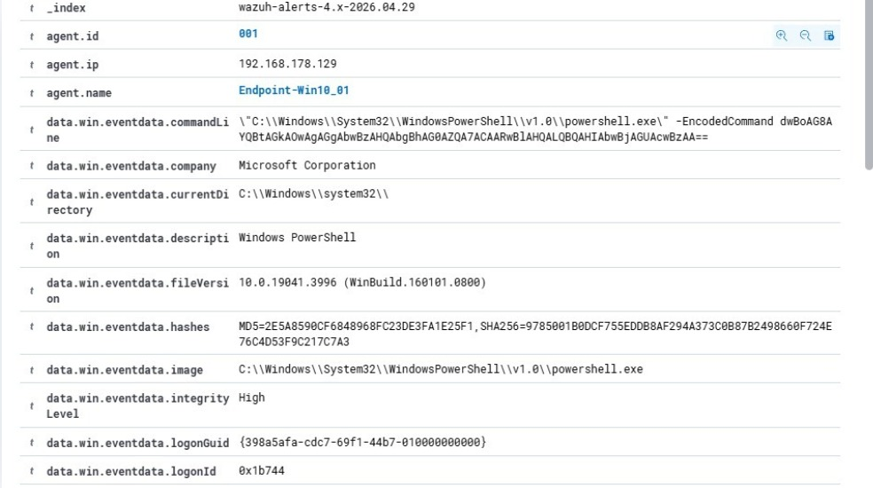

# 🛡️ EDR Implementation with Wazuh 4.14.2

> Blue Team Project | Sistem Endpoint Detection & Response


## 📋 Overview

Proyek ini membangun sistem EDR sederhana untuk **kantor kecil (15 komputer)**
yang mengalami masalah malware. Sistem dapat memonitor aktivitas endpoint
secara real-time dan mendeteksi behavior mencurigakan sebelum terlambat.

## 🏗️ Arsitektur

```text
Laptop Host
├── VM 1 → Wazuh Server (Manager + Indexer + Dashboard)
├── VM 2 → Windows 10 Endpoint (Wazuh Agent + Sysmon v15.15)
└── VM 3 → Ubuntu Desktop (Wazuh Agent)
Semua terhubung via ZeroTier (10.75.139.146)
```

## 🎯 Detection Results

| # | Skenario | MITRE | Rule ID | Level | Status |
|---|----------|-------|---------|-------|--------|
| 1 | EICAR Test File | T1204 | 62123 | 12 | ✅ Detected |
| 2 | LSASS Memory Dump | T1003.001 | 92900 | 12 | ✅ Detected |
| 3 | SAM Database Dump | T1003.002 | 62123 | 12 | ✅ Detected |
| 4 | Suspicious PowerShell | T1059.001 | 92066 | 4 | ✅ Detected |
| 5 | Persistence via Registry | T1547.001 | 60112 | 8 | ✅ Detected |
| 6 | New Service Created | T1543.003 | 61138 | 5 | ✅ Detected |
| 7 | WMI Parent-Child | T1047 | 100011 | 12 | ✅ Detected |
| 8 | LOLBIN Certutil Abuse | T1218 | 62123 | 12 | ✅ Detected |
| 9 | Discovery Activity | T1082 | 92031 | 3 | ✅ Detected |

> **9/9 skenario terdeteksi**, melebihi target minimum 3 dari 5

## 📸 Screenshots & Evidence

> 💡 **Note:** Untuk melihat seluruh 18 forensic evidence dan langkah simulasi secara lengkap, dapat mengakses [📁 Folder EDR Project Evidence](EDR_Project).

### 1. EICAR Malware Detection


### 2. Mimikatz SAM Dump / Credential Dumping


### 3. Suspicious PowerShell Activity


### 4. Persistence Detection (New Service)


### 5. Unusual Parent-Child Process (WMI Execution)


---
*Klik link di atas untuk ke-13 screenshot lainnya.*

## 🔧 Tools & Configuration

| Tool | Version | Role |
|------|---------|------|
| Wazuh | 4.14.2 | SIEM + EDR Platform |
| Sysmon | v15.15 | Windows Event Logging |
| ZeroTier | Latest | Private Overlay Network |
| Windows Defender | 4.18.26030.3011 | AV Layer |

## 📁 Repository Structure

```text
├── EDR_Project/     # 18 Evidence visual dari semua deteksi simulasi
├── configs/         # sysmon-config.xml + wazuh-local-rules.xml kustom
└── report/          # Final Technical Report formal (.pdf)

📄 Note: Seluruh materi penjelasan konsep EDR, langkah mitigasi insiden (Response Playbook), serta detail analisis forensik telah digabungkan secara lengkap di dalam dokumen EDR_Technical_Report_2026.pdf yang berada di dalam folder report/.
```

## 👥 Tim

| Role | Tugas |
|------|-------|
| Host | Setup VM, network, snapshot & backup |
| Detection & Forensik | Rules, query hunting, testing, export log |
| Endpoint Security | Install Wazuh server & agent, dashboard |
| Red Team Simulator | EICAR, Atomic Red Team, koordinasi testing |
| Analyst Forensik | Analisis, timeline, laporan |
| Dokumentasi | Laporan & slide presentasi |

## 📄 License
MIT License - For educational purposes only
